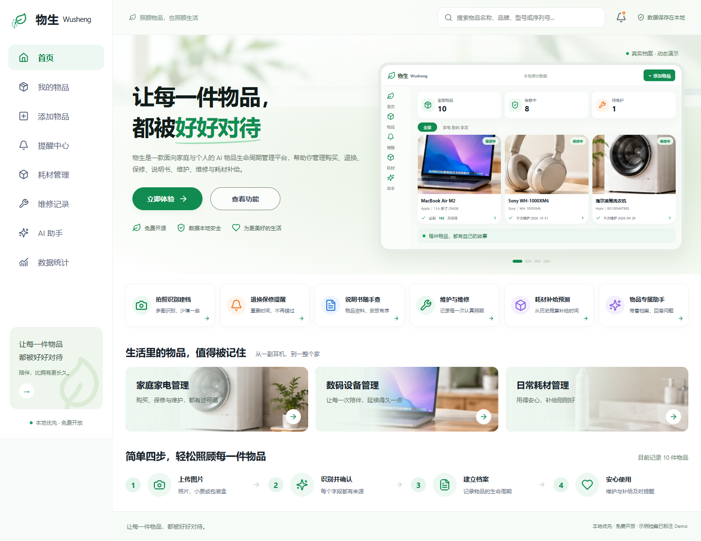
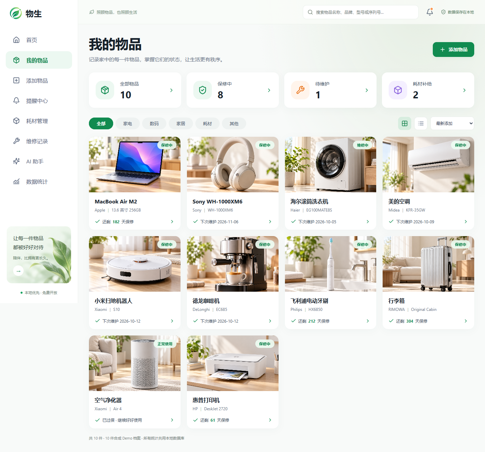
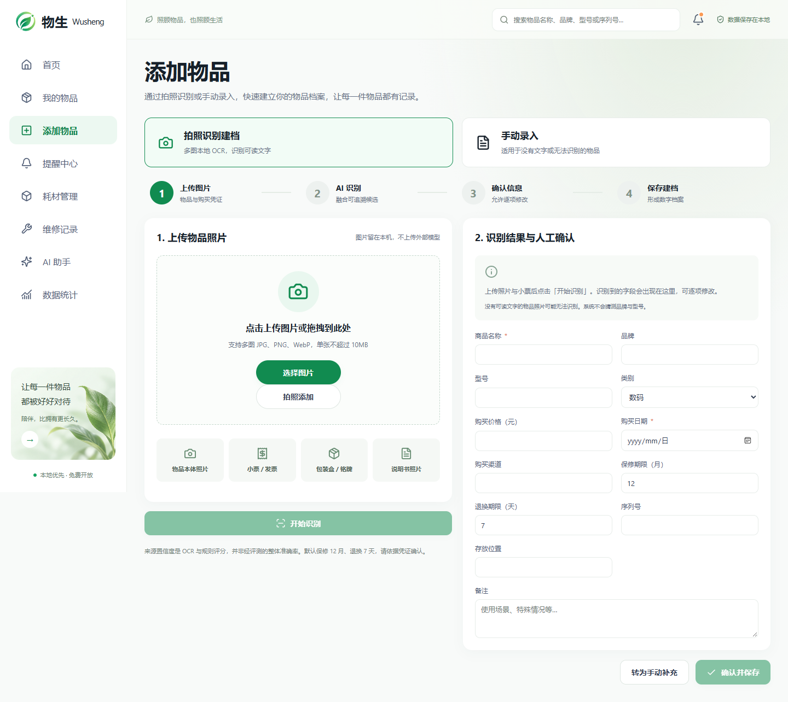
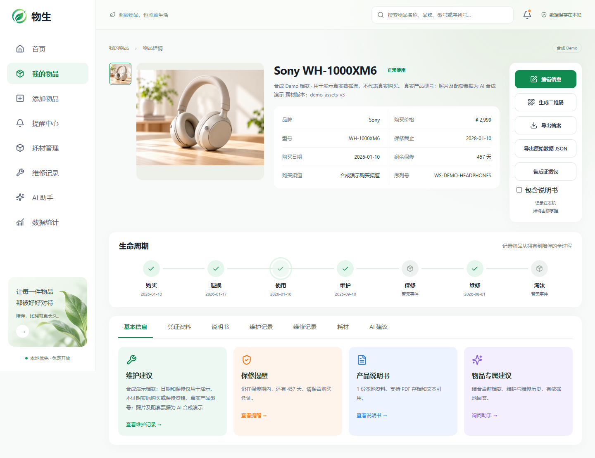
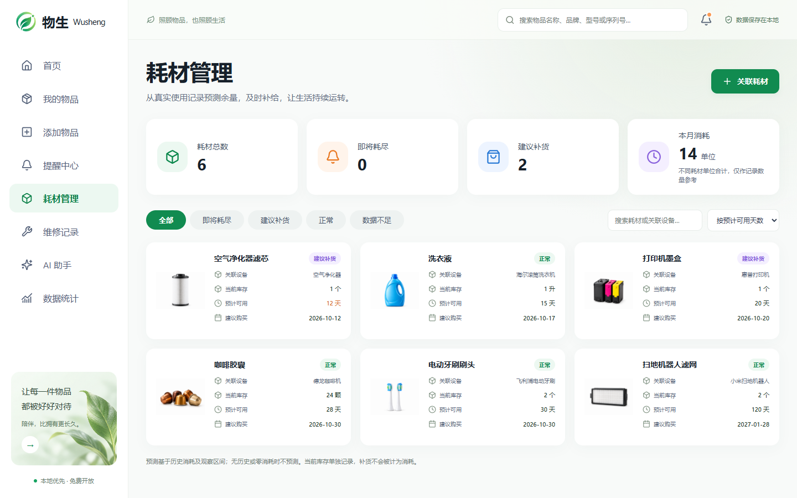
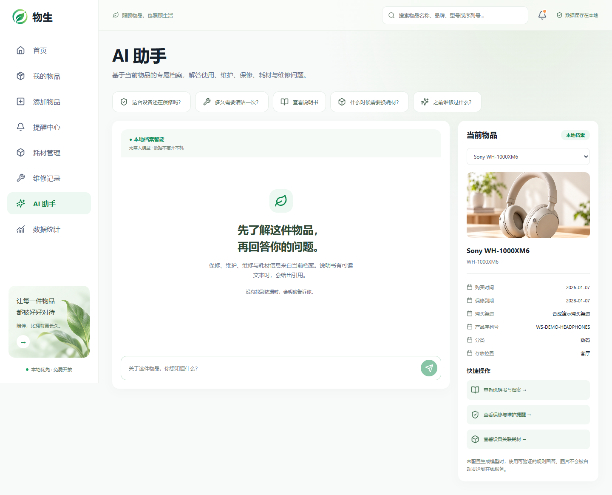

# 物生 Wusheng

[](https://github.com/3331083641-prog/wusheng/actions/workflows/ci.yml)

**AI 驱动的家庭物品全生命周期智能管理平台**

2026 全球校园人工智能算法精英大赛 AIC「AI+开源」算法主题赛 · 日常生活场景。团队：物生智联。

票据丢失、保修忘记、说明书难找、耗材忘换、维护遗漏、维修记录散乱——物生将购买、退换、使用、维护、保修、维修、耗材与淘汰连成一份可追溯档案。库存软件记录“有什么”，物生关注“一件物品进入生活之后发生了什么、接下来要照顾什么”。

## 评委快速体验

### 方法一：Windows 一键启动（推荐）

1. Clone 本仓库：`git clone https://github.com/3331083641-prog/wusheng.git`，进入 `wusheng` 文件夹。
2. 安装 **Python 3.12** 和 **Node.js 22 LTS**。
3. 双击根目录 [启动物生.cmd](启动物生.cmd)；ASCII 等效入口为 [start-wusheng.cmd](start-wusheng.cmd)。首次运行会清楚提示并自动安装锁定依赖，需要联网。
4. 浏览器自动打开 **http://127.0.0.1:8000**，新数据库生成 10 件合成 Demo 档案。首页轮播直接读取数据库，新增第 11 件会自动加入。

一物一码演示需手机与电脑连接**可互通的同一局域网**（通常是同一 Wi-Fi），电脑保持物生运行。

无需管理员权限、API Key、Ollama 或 Qwen。默认 **EvidenceProvider（本地档案智能）**，可体验首页、OCR 建档、生命周期、保修/维护/维修、耗材、PDF/扫描件 OCR、一物一码、售后包和基础档案问答。模型权重不随仓库分发，也不会自动下载。已有数据库与用户附件不会重置。

> **请勿直接双击 frontend/index.html。** 物生包含 React、FastAPI、SQLite、本地 OCR/附件与 AI Provider；`file://` 无法正常连接 API、数据库、路由、附件、AI 或二维码服务。

### 方法二：PowerShell

```powershell
powershell -ExecutionPolicy Bypass -File .\scripts\setup.ps1
powershell -ExecutionPolicy Bypass -File .\scripts\start.ps1
```

启动窗口保留服务状态与错误，按 Enter 停止本次服务；不修改防火墙。高级参数、开发 HMR 与可选模型配置见 [运行细节](docs/competition/runtime_guide.md)。

## 核心功能与自主边界


| 能力 | 实际实现 |
|---|---|
| 多图辅助建档 | 本地 RapidOCR、图片类型、字段候选融合、来源追溯、人工确认；无文字照片可手填 |
| Item Lifecycle Engine | 自主实现自然月期限、生命周期事件、保修/退换/维护提醒及维修进度 |
| Device–Consumable | 耗材通过数据库关系绑定物品，库存、消耗与补货历史共同驱动趋势估算 |
| PDF 本地知识 | 保存/查看/下载/删除说明书，文本提取、用户触发扫描件 OCR，按当前 Item 检索 |
| Item-specific AI Context | 当前物品的档案、说明书、维护、维修、耗材证据；默认规则，可选本机模型 |
| 一物一码 | LAN 只读分享、有效期、内容预览、撤销与令牌轮换；管理功能限电脑本机 |
| 凭证与售后 | 本体/小票/发票/铭牌等资料，字段依据、售后证据 ZIP、中文摘要 PDF、SHA256 |
| 档案导出 | 可阅读/打印的物品档案 PDF、机器可读 JSON 原始数据；售后 ZIP 独立保留 |
| 数据与提醒 | 统一数据统计、ICS、主动授权浏览器通知、本地完整备份与校验恢复 |

第三方 OCR、模型、框架能力不是本项目原创。Warden/HomeInventory 仅作为产品与交互思路参考，未直接复制源码。详见 [创新说明](docs/competition/innovation.md)、[开源融合](OPEN_SOURCE_USAGE.md)和[第三方清单](THIRD_PARTY.md)。

## 页面截图

| 首页 | 我的物品 |
|---|---|
|  |  |

| 建档 | 物品详情 |
|---|---|
|  |  |

| 耗材 | AI 助手 |
|---|---|
|  |  |

## 架构与目录

React 19 / TypeScript / Vite → FastAPI / SQLAlchemy → SQLite + 本机图片/PDF。RapidOCR ONNX 执行 OCR；pypdf / pypdfium2 提取或渲染 PDF；EvidenceProvider 默认提供本地证据问答，可显式连接回环 Ollama/OpenAI-compatible。服务按单进程运行。[架构与迁移](docs/competition/architecture.md)。

```text
.github/workflows/        Linux 完整 CI + Windows smoke
frontend/                 页面、正式图片、Playwright 测试
backend/                  Schema、迁移、生命周期、OCR/AI、pytest
docs/competition/         最终验收、Benchmark、实机步骤、演示脚本
docs/benchmark/           合成 OCR、授权中文框架、58 题 QA 与原始结果
docs/references/          页面截图与素材来源
scripts/                  Windows setup/start、校验、Benchmark、备份
data/                     本机运行数据，不进入 Git
LICENSES/                 依赖、模型与参考资源的许可原文
```

## 快速开始（Windows）

需要 Windows 10/11、Python **3.12**、Node **22 LTS**、npm；浏览器测试使用 Microsoft Edge。首次安装需联网；OCR 模型随锁定 Python 依赖安装，之后基本管理与 OCR 可在本机离线使用。

```powershell
git clone https://github.com/3331083641-prog/wusheng.git
cd wusheng
powershell -ExecutionPolicy Bypass -File .\scripts\setup.ps1
powershell -ExecutionPolicy Bypass -File .\scripts\start.ps1
```

打开 [首页](http://127.0.0.1:8000)，[API 文档](http://127.0.0.1:8000/docs)。普通 `start.ps1` 检查依赖、构建前端，由 FastAPI 在单端口 8000 托管生产界面；验证 `/health` → `/generate` → 前端后打开浏览器，同时支持安全局域网只读分享。只管理自己启动的进程，不修改防火墙。首次启动自动生成 **10 件物品、6 种耗材、3 条维修**及合成护理 PDF；已有数据库不会重置。数据不是真实用户资料或厂家手册。

开发者需要 Vite HMR 时运行 `scripts/start_dev.ps1`（前端 127.0.0.1:5173、后端 127.0.0.1:8000）。高级参数与退出方式见 [运行细节](docs/competition/runtime_guide.md)。

## 双层智能架构与 AI 边界

默认 `evidence`，不需要账号、密钥或模型。OCR 只提取图片文字，候选均可修改；分值是启发式分数，不是识别准确率。PDF 文本层提取后可引用；扫描件 OCR 需主动触发，最多 50 页，失败保留原文件。

第一层 **EvidenceProvider**：零模型依赖、可复现，基于当前物品证据生成规则回答。第二层 **Optional Local LLM**：用户已有本机模型时增强自然语言表达，仅连接回环服务，模型不可用时自动回退。AI 助手顶部读取真实 `/health` 状态，显示当前 Provider、实际模型名称或回退原因；每次回答底部标明「本地模型生成」或「本地档案规则」。

### 可选本地模型

如已有本机 Ollama 模型，在启动前设置：

```powershell
$env:WUSHENG_AI_PROVIDER = 'ollama'
$env:WUSHENG_OLLAMA_URL = 'http://127.0.0.1:11434'
$env:WUSHENG_OLLAMA_MODEL = '<本机已安装的模型名称>'
powershell -ExecutionPolicy Bypass -File .\scripts\start.ps1
```

也可在已有对应系统环境变量的情况下双击「启动物生.cmd」。启动入口尊重现有环境变量，默认不会强制启用模型。本项目支持可选本地 Qwen/Ollama 增强，模型权重不随仓库分发，不要求安装 Qwen。

不自动下载模型，只允许本机回环服务；模型缺失或调用失败回退。无依据和危险维修走规则边界。来源列表表示提供给模型的输入证据，生成文字仍需核对。本机已有 Qwen3-VL 已执行 58 题合成文本 QA，未启用视觉输入，也未上传权重。[运行细节](docs/competition/runtime_guide.md)。

## 一物一码与手机验证

普通 `scripts/start.ps1` 已默认支持，不需要另开 LAN 模式。`start_lan.ps1` 仅转调普通启动，作为兼容入口。脚本输出 LAN IP、电脑管理地址与手机地址，不修改系统网络或防火墙。管理限回环，手机通过随机 Token 查看只读档案。没有 LAN 地址时本机管理仍可用；连接 Wi-Fi 后在二维码 Drawer 重新检测，多网卡可选择地址。

**物生当前采用局域网二维码分享，不是公网永久访问服务。** 电脑管理地址是 `http://127.0.0.1:8000`；手机分享地址类似 `http://192.168.x.x:8000/share/<token>`。手机不能通过电脑的 `localhost` 访问物生。

扫码须满足：电脑正在运行物生；手机和电脑处于**可互通的同一局域网**（通常为同一 Wi-Fi）；路由器未开启客户端/访客隔离；Windows 防火墙允许 Python 在可信私人网络通信；二维码使用当前有效 LAN IP；Token 未过期或撤销。电脑关闭程序、IP 变化或手机切换网络均可能导致无法访问。脚本不自动修改防火墙。

新码默认 **7 天**，可选 24 小时/30 天/长期。**7 天只表示令牌期限，不保证电脑关闭之后仍能访问。** 名称/品牌/型号/使用状态/下次维护及本体照片默认公开，保修/生命周期/耗材可选择；购买日期、价格、渠道、位置、库存、维护/维修记录及备注均需明确授权。完整序列号、票据和发票始终隐藏。生命周期显示真实记录，未发生阶段不伪造日期。

说明书名称与 PDF 文件是独立权限，默认关闭。所有者可选择具体说明书，另行允许下载；**未来新增或替换上传的 PDF 只有开启单独的持续授权才自动公开**，当前未选择文件仍私有。在线阅读本身意味着接收者可保存文件，下载开关仅控制下载入口。文件实时读取当前数据库；删除、撤销、过期或轮换后旧链接不可再访问，已下载的副本无法远程收回。原有二维码不会因升级自动获得新权限。

用户提供的旧版实机截图已确认基础 LAN 扫码访问；**V2.2 图片/PDF/撤销的手机实机验证仍待用户完成**，按 [手机实测与排查步骤](docs/competition/mobile_validation.md)执行。自动化与安全边界见 [V2.2 手机分享验收](docs/competition/mobile_share_v22.md)。

## Benchmark 与测试

| 评测 | 范围与证据 |
|---|---|
| Synthetic OCR smoke | 3 张合成英文标签、15 字段；实际 OCR 结果见 [报告](docs/competition/ocr_benchmark.md) |
| Authorized Chinese OCR | 30 张目标规模、六类资料、字段/类型分组指标框架；**等待授权脱敏样本**，无虚构结果 |
| Item QA | 58 题固定日期合成档案；EvidenceProvider 与本机 Qwen 分别实跑；逐题来源、拒绝、事实与串物品检查 |

[Benchmark 汇总与指标限制](docs/competition/benchmark_summary.md)。这些结果不代表真实家庭票据准确率或通用模型质量。

```powershell
.\.venv\Scripts\python.exe -m pytest backend/tests -q
npm --prefix frontend run lint
npm --prefix frontend run build
powershell -ExecutionPolicy Bypass -File .\scripts\test_ui.ps1
.\.venv\Scripts\python.exe scripts/check_docs.py
.\.venv\Scripts\python.exe scripts/benchmark_ocr.py
.\.venv\Scripts\python.exe scripts/benchmark_qa.py --provider evidence
```

测试使用隔离 SQLite，不污染用户 data。Linux CI 验证 pytest/lint/build/文档链接；Windows CI 另测 PowerShell 语法、FastAPI 健康和 Demo。最终结果见 [test_results.md](docs/competition/test_results.md) 和 [发布验收](docs/competition/release_v2_acceptance.md)。

冻结后的小范围可用性修正见 [v1.0.1 验收](docs/competition/release_v101_acceptance.md)；原 `v1.0-aic2026` Tag 保持不变。

## 三种导出

首页轮播、双击入口、Provider 状态的历史体验结果见 [体验验收](docs/competition/showcase_acceptance.md)；手机分享 V2.2 的 137 项后端/42 项浏览器结果见 [手机分享验收](docs/competition/mobile_share_v22.md)。既有 `v1.0-aic2026`、`v1.0.1-aic2026` 均保持原位置。

物品详情的「导出档案」生成含图片、基本信息、生命周期、提醒、维护、维修、耗材和附件目录的中文 **PDF**，用于阅读/打印。「导出原始数据 JSON」保留结构化档案，供程序处理。**售后证据包 ZIP** 用于整理售后材料，仍独立提供。档案 PDF 不自动嵌入票据和说明书全文，不写入磁盘路径。

## 隐私、Local First 与备份

运行文件位于 `data/wusheng.db`、`data/images/items/`、`data/documents/manuals/`、`data/uploads/drafts/`。可用 `WUSHENG_DATA_DIR` 改变位置；`.env.example` 是配置说明，应用不自动加载 `.env`。照片、票据、PDF 默认留在本机。

统计页可下载数据库与被引用附件的完整 ZIP，恢复校验路径、Schema、SQLite 和 SHA256，并保存恢复前备份。恢复兼容旧 V2 格式，失败回滚，旧附件不会自动清除。只恢复可信本人备份。用户数据、密钥、日志、依赖、模型、视频均被 Git 排除。正式生成式 UI 素材单独登记，不适用源码 MIT。

## Known Limitations 与比赛冻结

- 真实手机扫码/相机实测和授权中文复杂票据数据集仍待完成。
- QA 是合成自动判据；Qwen 有 1 题未命中事实判据，需要人工语义复核。危险守卫不是完整维修安全专家。
- 纯图片视觉识别未启用；OCR 无文字时手动录入。未下载新模型。
- localhost 生产页有基础 PWA；普通 LAN HTTP 不保证可安装，没有离线数据库管理。
- 浏览器关闭后不提供后台通知，使用 ICS/系统日历。
- Windows 曾一次 Node worker 原生异常退出，完整重跑通过，根因未确认；不宣称彻底消除。

本版本冻结功能主线；后续进入技术报告、演示视频和提交资料。比赛规则以[官方通知](https://www.aicomp.cn/notice/notice-3/4890.html)为准，不宣称已获奖或已完成报名。

## 开源与披露

[LICENSE](LICENSE)：自主源码和文档 MIT；第三方组件、模型、商标与用户图像保留各自权利。
[THIRD_PARTY](THIRD_PARTY.md) · [OPEN_SOURCE_USAGE](OPEN_SOURCE_USAGE.md) · [AI_USAGE](AI_USAGE.md) · [CONTRIBUTING](CONTRIBUTING.md) · [清理记录](docs/RELEASE_CLEANUP.md)
