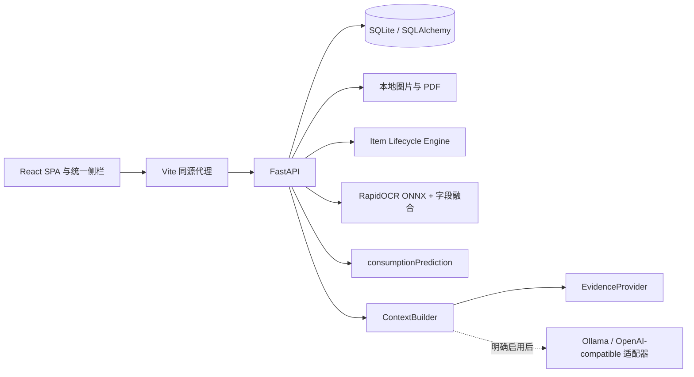

# 架构与数据一致性

物品、事件、图片、文档、维护、维修、耗材、消耗、补货、提醒、识别结果和会话分表关联。Schema 字段清单见 phase0.md，实际模型见 backend/models.py；自然日统一 Asia/Shanghai，时间戳 UTC，金额整数分。

写操作用 SQLAlchemy Session 事务；异常回滚。库存扣减带条件更新，防止扣成负数。完成和延后提醒不被日常 snapshot 协调覆盖，来源日期改变才重新计划。维修顺序限制待预约→诊断中→维修中→完成，保留进度历史、报修与完成事件。

React 所有页面读取 /snapshot；写完 refresh 同一数据源。详情 /items/{id} 同步关联记录；不独立 mock 统计。SSR 未使用，路由 SPA，侧栏持续存在。

数据库 `data/wusheng.db`；附件保存在 `data/` 子目录。默认仅回环地址监听，无账户，适用于本机。生产打包发布部署和互联网服务不在当前范围。

OCR 图片格式、大小和像素数校验；最多8张、单张10MB，PDF最多20MB/200页，限制加密文件。模型加载失败返回可恢复错误。未完成 OCR 会话附件可能保留，暂未提供自动清理，以避免删除私人资料。

无需外部 AI。Ollama/OpenAI-compatible 提供替换接口，但当前 /generate 固定走本地证据规则。在线适配器要求显式 external_consent；未来 UI 接入前须补同意提示与验证。
