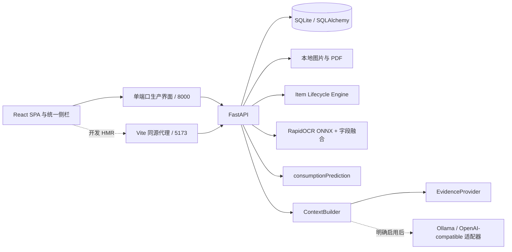

# 架构与数据一致性

物品、事件、图片、文档、维护、维修、耗材、消耗、补货、提醒、识别结果和会话分表关联。字段以 [当前模型](../../backend/models.py) 为准；自然日统一 Asia/Shanghai，时间戳 UTC，金额整数分。

写操作用 SQLAlchemy Session 事务；异常回滚。库存扣减带条件更新，防止扣成负数。完成和延后提醒不被日常 snapshot 协调覆盖，来源日期改变才重新计划。维修顺序限制待预约→诊断中→维修中→完成，保留进度历史、报修与完成事件。

React 通过 /snapshot 读取统一业务状态；写完 refresh 同一数据源。详情 /items/{id} 同步关联记录；不独立 mock 统计。首页 /home/showcase 是同一 SQLite 的精简投影，复用 sync_all、item_data、LifecycleEvent 与 consumable_data，不建立第二套 Demo 或在前端重算保修/消耗。首页读取全部物品的文字元数据，只渲染当前图与最多三个缩略图，预加载下一张；focus、visibility 和 Zustand refresh 发出的统一事件刷新投影。SSR 未使用，路由 SPA，侧栏持续存在。

数据库 `data/wusheng.db`；附件保存在 `data/` 子目录。普通 start.ps1 监听 0.0.0.0，由 FastAPI 单端口托管生产 SPA 和只读分享；管理 API 限回环，LAN 只允许令牌投影及必要静态资源。开发 start_dev.ps1 的后端仅监听回环。无账户，互联网部署不在当前范围。

OCR 图片格式、大小和像素数校验；建档最多10张、单张10MB，PDF最多50MB，拒绝加密文件。扫描 OCR 每份最多50页、渲染页最多800万像素；模型加载失败保留原 PDF 并标明失败。未保存草稿有到期清理，正式用户附件不会当作缓存删除。

无需外部 AI。/generate 通过 ProviderFactory 默认使用本地证据规则，可选择用户已安装的本机 Ollama / OpenAI-compatible 服务，限定 HTTP 回环地址并检索当前物品的有限相关证据。未配置、模型不存在或调用失败时自动回退，/health 返回 configuredProvider、activeProvider、fallbackReason。没有开放外部云端模型或自动下载模型。

扫描 PDF 使用 pypdfium2 渲染并复用 RapidOCR，用户显式触发，状态与文本写回 Document。分享模式由 FastAPI 托管构建后的前端，私人网络地址动态检测；令牌只读投影不开放管理 API。凭证中心保留 OCR 候选与人工修改依据；售后 ZIP 包含原图、摘要 PDF 和 SHA256 清单。完整备份与恢复在单进程档案操作门控下执行，校验路径/版本/SQLite/哈希，保存恢复前备份并支持失败回滚。

ShareLink 通过 expiresAt（UTC）与 options 存储分享有效期和隐私范围。新分享默认 7 天，支持 24 小时 / 30 天 / 长期；旧分享通过无损增列保留 null 到期时间。未知、过期、撤销的 Token 返回同一 404；图片端点也检查有效期。公共投影不暴露 itemId、序列号、价格、渠道、票据或说明书全文；生命周期只发布类别和日期，避免用户自填标题带出隐私。修改范围需撤销或旋转令牌。

备份 schemaVersion 升至 3，仍接受 V2 schemaVersion=2。在隔离候选数据库完成增列与完整性检查之后才恢复到本机，失败不触碰业务表。有效期迁移不重算旧购买、库存或 PDF 记录。

QA Benchmark 使用固定日期的独立 SQLite、实际 ContextBuilder 与 ProviderFactory。未知问题和危险维修先执行证据/安全守卫；生成服务只收到当前物品有界上下文。指标与逐题原始结果见 [Benchmark 汇总](benchmark_summary.md)。
